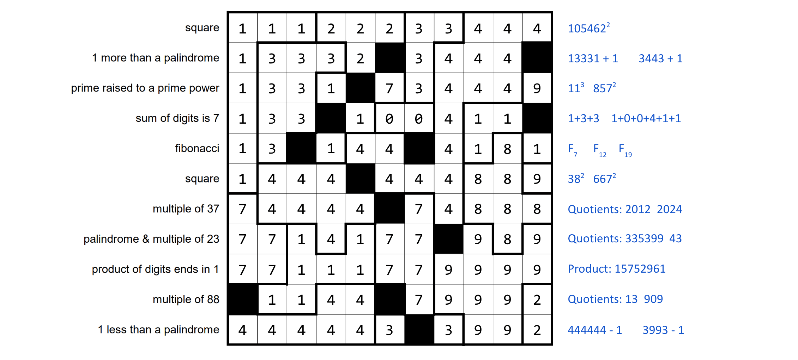

# Jane Street May 2024 Puzzle Solver

This solver was created to solve the “Number Cross 4” puzzle, published on the Jane Street website in May 2024.

## Usage

Assuming that Go is installed on your system (if not: [how to install Go](https://go.dev/doc/install)), run:

```
$ go run main.go
```

## Solution

The solver displays the candidates (only the first valid candidate per row) and the complete solution. It also saves them in the `./candidates` directory.


The (unique) grid satisfying all constraints is saved in `./candidates/11_rows.txt`.



Therefore, the solution, corresponding to the sum of all the numbers formed in the completed grid, is `88,243,711,283`.
